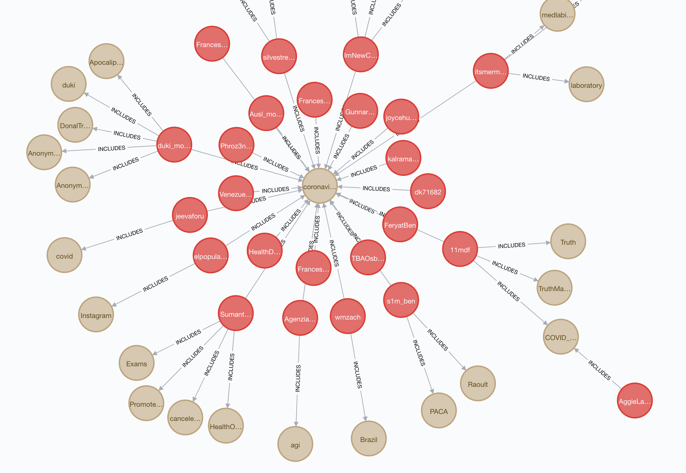
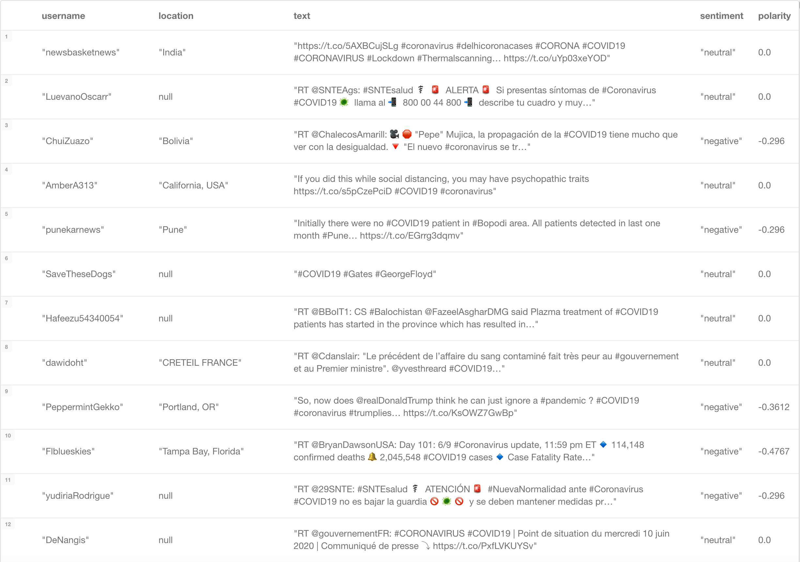
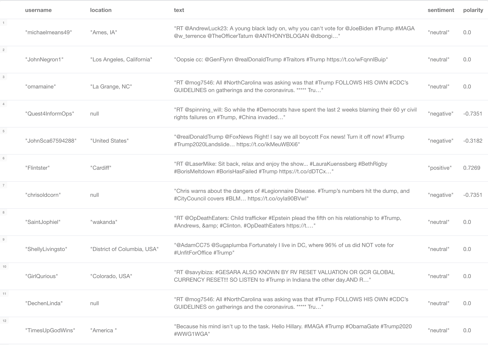

# TwitterStreamingNeo4J

In this project, tweets were streamed from Twitter using Kafka and Tweepy. The resulting
tweets were then processed and stored in a graph database using Neo4J. 

## Visualizations

### Hashtags and Tweets

### Tweets with #COVID19

### Tweets with #Trump

