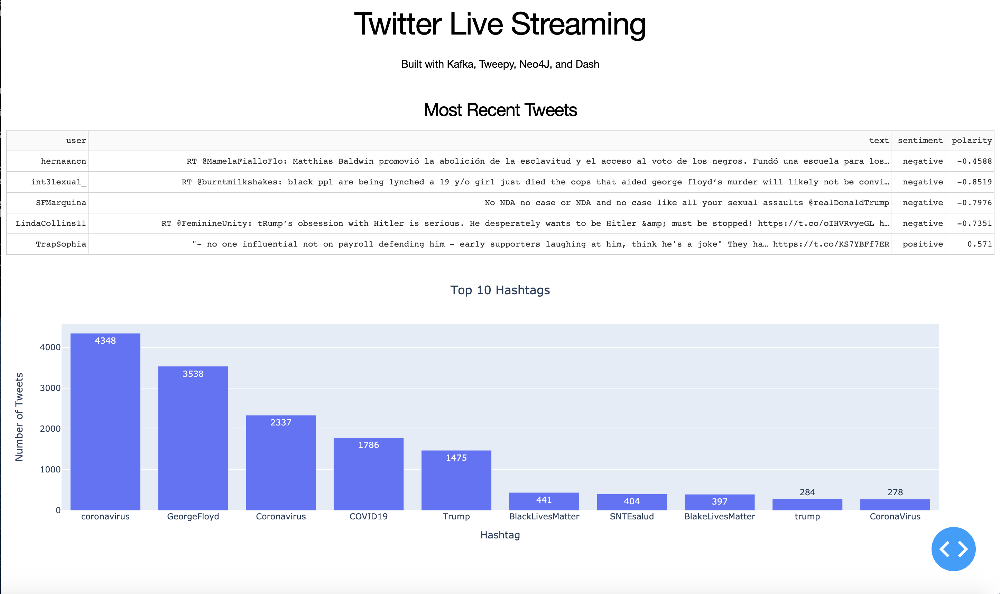

# TwitterStreamingNeo4J

In this project, tweets were streamed from Twitter using Kafka and Tweepy, and stored in a Neo4J graph database, which 
was used for live analytics in a dash application. 

## Dash App

## Neo4J Visualizations

### Hashtags and Tweets

### Tweets with #COVID19

### Tweets with #Trump

